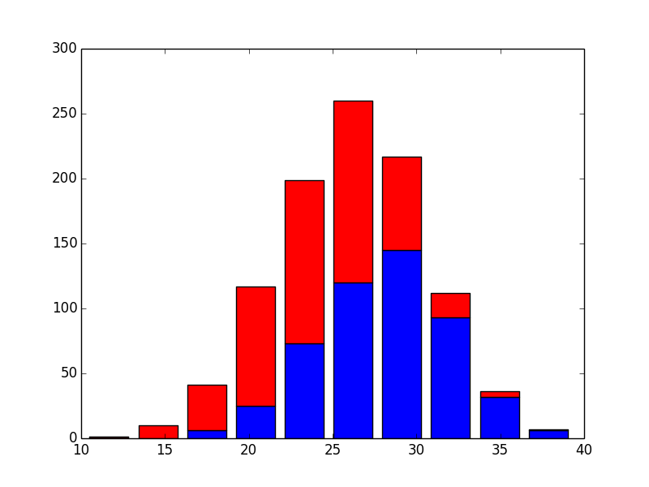

# Environment Settings for Machine Learning

* Mac (El Capitan)

# pyenv

* http://qiita.com/y__sama/items/5b62d31cb7e6ed50f02c

# Sublime Text from Terminal

* http://qiita.com/hirokishirai/items/6b008623d1ea05b4d92e

# Code

* https://www.youtube.com/watch?v=N9fDIAflCMY

# Generated Graph

